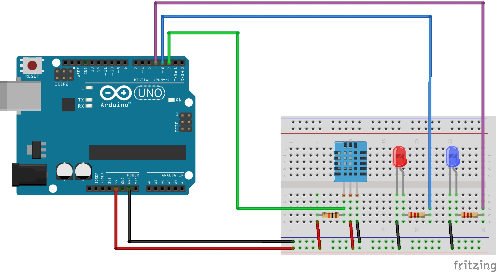

# Arduino DHT11

An Arduino connected to a temperature and humidity sensor that turns leds based on the values received from the sensor.

# Components

* 1 Arduino Uno R3
* 1 DHT11 (temperature and humidity sensor)
* 2 Resistors 220Ω
* 1 Resistors 10kΩ
* 2 LEDs

# Circuit

An Arduino with a temperature and humidity sensor connected that will turn on the red led when the temperature is higher than 30C or the blue one when the himidity is higher than 70%

# Code

The code for Arduino can be found in the `src` directory. It's just a single file written in `C`.
